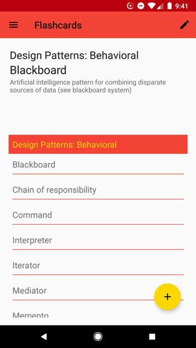
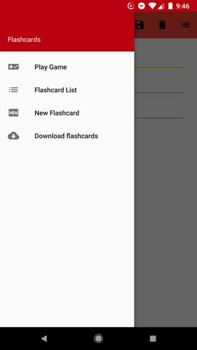
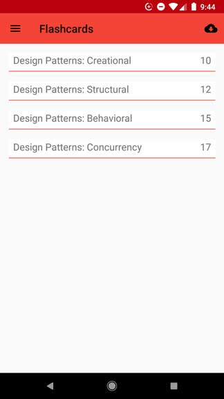
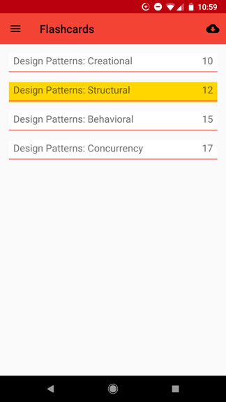
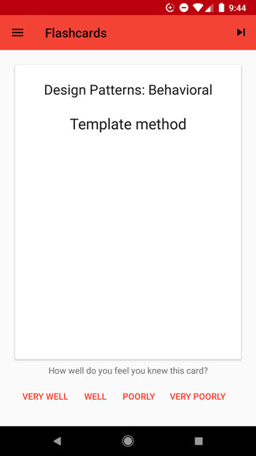
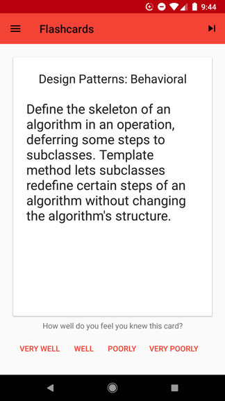

# Flashcard App Kotlin
A flashcard app using Kotlin on Android
Users can add and edit flashcards, as well as download flashcards from a
Firebase database. The app uses a simple spaced repetition algorithm
to keep the user learning.

    
     

    
    

    
    

    
    

Technologies used:
- Kotlin
- Dagger2
- Room
- ViewModel
- LiveData
- JUnit
- MockitoKotlin
- Espresso
- Flexible Adapter - https://github.com/davideas/FlexibleAdapter
- Firebase Realtime Database
- Google Sign-In
- Picasso
- Picasso Transformations - https://github.com/wasabeef/picasso-transformations
- Uncommon Maths ExponentialGenerator - https://maths.uncommons.org/
